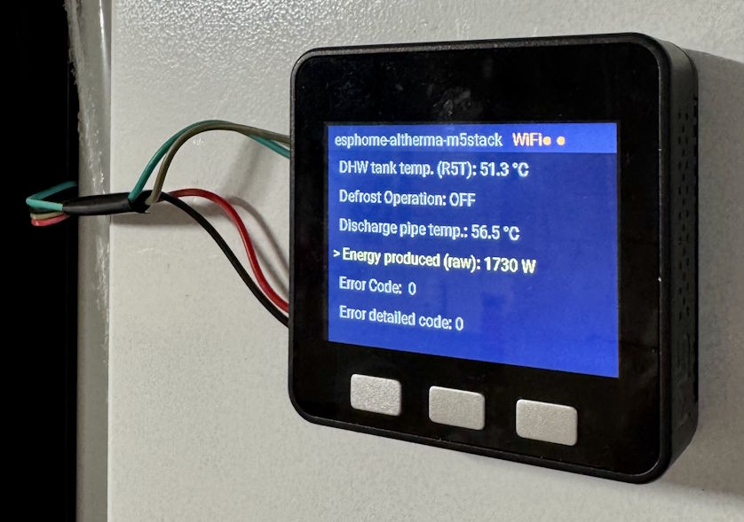
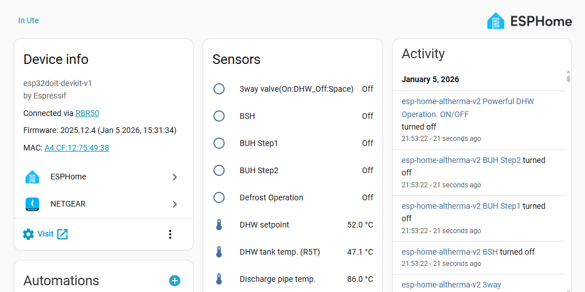
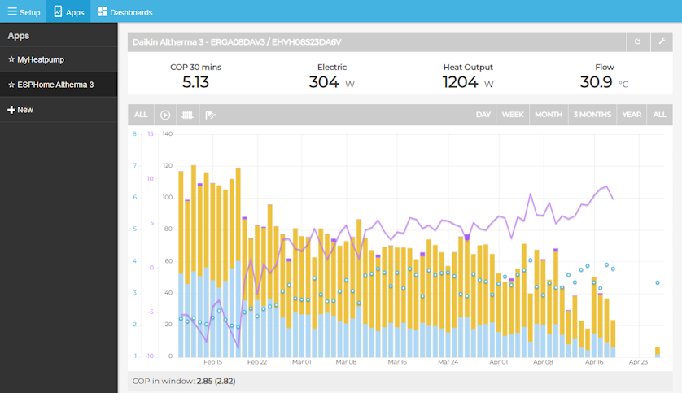

# ESPHome Altherma

[](https://esphome.io/)
[](https://www.home-assistant.io/)
[](https://github.com/jjohnsen/esphome-altherma/stargazers)

A native [ESPHome](https://esphome.io/) custom component for monitoring Daikin Altherma 3 heat pumps via the X10A connector. It exposes temperatures, voltages, currents, and other operational data directly to [Home Assistant](https://www.home-assistant.io/) - no MQTT, no manual config, just plug and play.

🌐 [Web Installer](https://esphome-altherma.jjohnsen.no) · 💬 [HA Community](https://community.home-assistant.io/t/esphome-altherma-monitor-your-daikin-altherma-3-heat-pump-via-x10a/1000476) · 🗨️ [Discussions](https://github.com/jjohnsen/esphome-altherma/discussions) · 📖 [Emoncms Setup Guide](https://jjohnsen.no/2026/esphome-altherma-emoncms-setup-guide/)

  
M5Stack Basic running ESPHome Altherma

  
ESPHome Altherma with real-time data in Home Assistant


  
ESPHome Altherma + Emoncms and My Heatpump App

## Quick Start

1. Open the [Web Installer](https://esphome-altherma.jjohnsen.no) in Chrome/Edge
2. Connect your ESP32 via USB and click **Connect**
3. Flash the firmware and configure Wi-Fi
4. The device appears automatically in Home Assistant 🎉

No command line needed. See [Installation](#installation) for more options.


## Features

- **Real-time sensor data** - temperatures, voltages, currents, flow rates, pressures, fan speeds, and more
- **Model-specific configuration** via modular YAML files for different Altherma units
- **Multiple board support** - ESP32, ESP32-S3, and M5Stack AtomS3 Lite
- **Browser-based installation** via [ESP Web Tools](https://esphome.github.io/esp-web-tools/) (no command line needed)
- **OTA updates** with automatic update checking via GitHub releases
- **Mock UART mode** for development and testing without hardware

## Supported Boards

| Board | YAML Config | UART RX Pin | UART TX Pin |
| -- | -- | -- | -- |
| [ESP32 DevKit](https://www.espboards.dev/esp32/esp32doit-devkit-v1/) | `esphome-altherma-esp32.yaml` | GPIO 16 | GPIO 17 |
| [ESP32-S3 DevKit](https://docs.espressif.com/projects/esp-dev-kits/en/latest/esp32s3/esp32-s3-devkitc-1/) | `esphome-altherma-esp32-s3.yaml` | GPIO 2 | GPIO 1 |
| [M5Stack AtomS3 Lite](https://docs.m5stack.com/en/core/AtomS3%20Lite) | `esphome-altherma-atoms3.yaml` | GPIO 2 (G1) | GPIO 1 (G2) |

## Hardware Requirements

* ESP32 development board (ESP8266 may also work)
* Daikin Altherma heat pump with X10A connector
* 5-pin JST EH 2.5 mm connector or 4 Dupont M-F wires

### Wiring

Connect the ESP32 to the Altherma unit using the X10A connector:

| X10A Pin | Signal | ESP32 DevKit | M5Stack AtomS3 Lite / ESP32-S3 |
| -- | -- | -- | -- |
| 1 | 5V | 5V / VIN | 5V |
| 2 | TX (pump → ESP) | RX pin (GPIO 16) | RX pin (GPIO 2) |
| 3 | RX (ESP → pump) | TX pin (GPIO 17) | TX pin (GPIO 1) |
| 4 | NC | Not connected | Not connected |
| 5 | GND | GND | GND |

> **Note:** The heat pump's TX connects to the ESP's RX, and vice versa (crossover).

Refer to the [ESPAltherma wiring guide](https://github.com/raomin/ESPAltherma?tab=readme-ov-file#daikin-altherma-4-pin-x10a-connection) for additional details and photos.

## Successful Installs

| Board                  | Heat Pump                                | User      | Additional info
| --                     | --                                       | --        | --
| Generic esp32dev board | ERGA08DAV3 / EHVH08S23DA6V               | @jjohnsen | This repo ;)
| M5Stack AtomS3 Lite    | DAIKIN Altherma 3 R Ech2o / EHSXB08P30EF | @maromme  | https://github.com/jjohnsen/esphome-altherma/discussions/4
| DOIT ESP32 DEVKIT V1   | EHVX08S26CB9W                            | @MaBeniu  | https://github.com/jjohnsen/esphome-altherma/discussions/5
| esp32dev | ERLQ011CAV3 / EHBX11CB9W || [Detailed setup guide in French](https://domo.rem81.com/index.php/2026/01/12/ha-monitoring-de-ma-pac-daikin-altherma-avec-esphome-esphome-altherma-alternative-a-espaltherma/)
| ESP32-C6-WROOM-1       | EHBH16C9W                         | @AndriesMuylaert | Includes relay + onboard sensors - https://github.com/jjohnsen/esphome-altherma/discussions/11

## Installation

> **⚠️ Note:** This repo currently includes sensor mappings for the **ERGA-D EHV/EHB/EHVZ DA series (04-08kW)** and the **ERLA D EBSH-X 16P30-50 D series 11-16kW-ECH2O**. Contributions for other models are welcome!

### Option 1: Browser Install (ESP Web Tools)

The easiest way to get started - no tools to install.

1. Open https://jjohnsen.github.io/esphome-altherma/ and click **Connect**
   
2. Follow the guided process to:
   - Flash the firmware
   - Connect to Wi-Fi
   - Add the device to Home Assistant
   

OTA Updates are available within Home Assistant:


### Option 2: Command Line (ESPHome CLI)

1. [Install ESPHome](https://esphome.io/guides/getting_started_command_line/)
2. Clone this repository:
   ```sh
   git clone https://github.com/jjohnsen/esphome-altherma.git
   cd esphome-altherma
   ```
3. Configure Wi-Fi credentials in `secrets.yaml`:
   ```yaml
   wifi_ssid: "YourWiFiSSID"
   wifi_password: "YourWiFiPassword"
   ```
4. Connect your ESP32 via USB and flash:
   ```sh
   esphome run esphome-altherma-esp32.yaml
   ```
5. After the initial flash, subsequent updates can be done wirelessly (OTA)

## Configuration

### Model Files (`confs/*.yaml`)

Model files define the available sensors for specific Altherma units. Each sensor entry specifies the UART register, byte offset, data size, and converter ID used to decode the value.

**Available models:**
- `erga_eh_da_04_08.yaml` - ERGA-D EHV/EHB/EHVZ DA series (04-08kW)
- `erla_d_ebsh_11_16_ech2o.yaml` - EBSXB16P50DF / ERLA D EBSH-X 16P30-50 D series 11-16kW-ECH2O

**Community-contributed models:**
- [EHVX configs by @MaBeniu](https://github.com/MaBeniu/esphome-altherma/tree/main/confs)

### Board-Specific Files

Choose the YAML file matching your board:
- `esphome-altherma-esp32.yaml` - Generic ESP32
- `esphome-altherma-esp32-s3.yaml` - ESP32-S3 DevKit
- `esphome-altherma-atoms3.yaml` - M5Stack AtomS3 Lite

Each includes `base.yaml` (shared component setup) and the model config from `confs/`.

## Guides

- **[ESPHome Altherma + Emoncms Setup Guide](https://jjohnsen.no/2026/esphome-altherma-emoncms-setup-guide/)**  
   Long-term heat pump performance monitoring with the MyHeatpump dashboard in Home Assistant. Covers Emoncms installation, input/feed setup, and COP tracking.

## Development

### Setting Up a Dev Environment

```sh
python3.11 -m venv .venv
source .venv/bin/activate
pip install --upgrade pip
pip install esphome
esphome compile esphome-altherma-esp32.yaml
```

### Mock UART Mode

For development without physical hardware, enable mock UART mode by adding the build flag:

```yaml
esphome:
  platformio_options:
    build_flags:
      - -DUSE_MOCK_UART
```

This provides simulated register responses so you can test the component logic without an actual Altherma connection.

### Project Structure

```
base.yaml                          # Shared ESPHome config (logger, API, OTA, UART, hub)
esphome-altherma-esp32.yaml        # Board config: ESP32 DevKit
esphome-altherma-esp32-s3.yaml     # Board config: ESP32-S3
esphome-altherma-atoms3.yaml       # Board config: M5Stack AtomS3 Lite
confs/
  erga_eh_da_04_08.yaml            # Sensor definitions for ERGA-D series
  erla_d_ebsh_11_16_ech2o.yaml     # Sensor definitions for ERLA D EBSH-X 11-16kW-ECH2O
components/altherma_hub/
  __init__.py                      # ESPHome component definition (Python)
  altherma_hub.cpp                 # Hub implementation (C++)
  altherma_hub.h                   # Hub header
  sensor.py                        # Sensor platform
  binary_sensor.py                 # Binary sensor platform
  text_sensor.py                   # Text sensor platform
  mock_uart.h                      # Mock UART for testing
  lib/
    converters.h                   # Vendored from ESPAltherma
    labeldef.h                     # Vendored from ESPAltherma
```

### Vendored ESPAltherma Files

This project vendors selected files from [ESPAltherma](https://github.com/raomin/ESPAltherma):

| Source File | Local Path |
| -- | -- |
| `include/converters.h` | `components/altherma_hub/lib/converters.h` |
| `include/labeldef.h` | `components/altherma_hub/lib/labeldef.h` |

**To update vendored files from upstream:**

```bash
# Add ESPAltherma as a remote (one-time setup)
git remote add espaltherma https://github.com/raomin/ESPAltherma.git

git fetch espaltherma
git checkout espaltherma/main -- include/converters.h
git checkout espaltherma/main -- include/labeldef.h

git mv -f include/converters.h components/altherma_hub/lib/converters.h
git mv -f include/labeldef.h components/altherma_hub/lib/labeldef.h

git commit -m "Update ESPAltherma vendored files"
rmdir include
```

## Contributing

Contributions are welcome! In particular:

- **Sensor mappings for other Altherma models** - add a new file under `confs/` with the register definitions for your unit
- **Bug reports and fixes** - open an issue or pull request

If you have a successful install with a model not listed above, please share it in the [Discussions](https://github.com/jjohnsen/esphome-altherma/discussions).

## License

This project is provided as-is for educational and personal use.

Please respect the licenses of the dependencies:
- ESPAltherma files are subject to their [original license](https://github.com/raomin/ESPAltherma/blob/main/LICENSE)
- ESPHome is licensed under the [MIT License](https://github.com/esphome/esphome/blob/dev/LICENSE)

## Credits

- Based on [ESPAltherma](https://github.com/raomin/ESPAltherma) by raomin
- Built with [ESPHome](https://esphome.io/)
- Integrates with [Home Assistant](https://www.home-assistant.io/)
